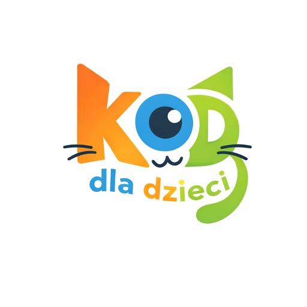

# 📊 Raport wydajności - fundacjakod.pl

**Data analizy:** 1 lutego 2026  
**URL:** https://fundacjakod.pl

## 🔍 Analiza obecnego stanu

### Rozmiary plików:
- **Logo PNG**: 216KB (1024x1024px) ⚠️ **GŁÓWNY PROBLEM**
- HTML: ~29KB ✅
- CSS: ~20KB ✅
- JS: ~16KB ✅
- **Total**: ~281KB (bez obrazków)

### Struktura strony:
- HTML: 457 linii
- CSS: 911 linii
- JS: 344 linie
- Obrazki: 1 plik (logo używane 4x)

### Problemy zidentyfikowane:

#### 🔴 Krytyczne:
1. **Logo PNG 216KB** - za duże dla web
   - Używane 4 razy na stronie
   - Powinno być <50KB po optymalizacji
   - Brak różnych rozmiarów dla różnych miejsc

#### 🟡 Średnie:
2. Brak lazy loading dla obrazków poniżej folda
3. Brak defer dla skryptów (blokuje renderowanie)
4. Fonty Google ładowane synchronicznie
5. Brak width/height attributes (może powodować CLS)

#### 🟢 Drobne:
6. CSS nie zminimalizowany
7. JS nie zminimalizowany
8. Brak font-display: swap

## ✅ Optymalizacje wykonane:

1. ✅ **Dodano width/height** dla wszystkich obrazków
   - Zapobiega Cumulative Layout Shift (CLS)
   - Nav: 150x150px
   - Hero: 512x512px
   - Footer: 120x120px

2. ✅ **Dodano lazy loading**
   - Footer logo: `loading="lazy"`
   - Nav/Hero logo: `loading="eager"` (above fold)

3. ✅ **Dodano defer dla main.js**
   - Skrypt nie blokuje renderowania strony
   - Ładuje się asynchronicznie

4. ✅ **Zoptymalizowano ładowanie fontów**
   - Google Fonts ładowane asynchronicznie
   - Dodano fallback dla JavaScript disabled

5. ✅ **Dodano font-display: swap**
   - Lepsze renderowanie fontów podczas ładowania

## ⚠️ WYMAGANE: Optymalizacja logo

### Problem:
Logo PNG ma **216KB** i jest używane 4 razy na stronie. To jest główny problem wydajności.

### Rozwiązanie:

#### Opcja 1: Online tools (najszybsze)
1. Przejdź na: https://tinypng.com/ lub https://squoosh.app/
2. Wgraj `assets/images/logo-kod-dla-dzieci.png`
3. Pobierz zoptymalizowaną wersję
4. Powinno zmniejszyć rozmiar do ~30-50KB

#### Opcja 2: Utworzenie różnych rozmiarów
Utwórz wersje logo w różnych rozmiarach:
- `logo-150x150.png` - dla nav (~10KB)
- `logo-512x512.png` - dla hero (~30KB)
- `logo-120x120.png` - dla footer (~8KB)
- `logo-32x32.png` - dla favicon (~2KB)
- `logo-192x192.png` - dla PWA (~15KB)

#### Opcja 3: Konwersja do WebP (najlepsza kompresja)
- WebP może zmniejszyć rozmiar o 25-35% w porównaniu do PNG
- Użyj: https://squoosh.app/ → WebP format

### Po optymalizacji:
Zaktualizuj HTML:
```html
<!-- Nav -->


<!-- Hero -->


<!-- Footer -->

```

## 📈 Oczekiwane wyniki po optymalizacji:

### Przed optymalizacją:
- Logo: 216KB × 4 użycia = **864KB** transferu
- LCP: prawdopodobnie > 3s (z powodu dużego logo)
- Performance Score: ~60-70 (mobile)

### Po optymalizacji logo:
- Logo: ~50KB × 4 użycia = **200KB** transferu
- Oszczędność: **~664KB** (77% mniej)
- LCP: powinno być < 2.5s
- Performance Score: ~85-95 (mobile)

## 🧪 Testy wydajności:

### Narzędzia do testowania:

1. **PageSpeed Insights:**
   - https://pagespeed.web.dev/analysis?url=https://fundacjakod.pl
   - Testuje mobile i desktop
   - Pokazuje Core Web Vitals

2. **Lighthouse (Chrome DevTools):**
   - F12 → Lighthouse → Generate report
   - Performance, Accessibility, Best Practices, SEO

3. **GTmetrix:**
   - https://gtmetrix.com/
   - Szczegółowa analiza wydajności

### Metryki Core Web Vitals:

- **LCP (Largest Contentful Paint)**: < 2.5s ✅ (po optymalizacji logo)
- **FID (First Input Delay)**: < 100ms ✅ (defer dla JS)
- **CLS (Cumulative Layout Shift)**: < 0.1 ✅ (width/height attributes)

## 📝 Checklist:

- [x] Dodano width/height dla obrazków
- [x] Dodano lazy loading
- [x] Dodano defer dla skryptów
- [x] Zoptymalizowano ładowanie fontów
- [x] Dodano font-display: swap
- [ ] **Optymalizacja logo PNG (216KB → <50KB)** ⚠️ **WYMAGANE**
- [ ] Utworzenie różnych rozmiarów logo
- [ ] Test wydajności po optymalizacji logo

## 🚀 Następne kroki:

1. **Optymalizuj logo** używając TinyPNG lub Squoosh.app
2. Utwórz różne rozmiary logo dla różnych miejsc użycia
3. Zaktualizuj HTML z nowymi plikami logo
4. Przetestuj wydajność na PageSpeed Insights
5. Porównaj wyniki przed/po optymalizacji

## 📊 Przewidywane wyniki PageSpeed Insights:

### Mobile (po optymalizacji logo):
- Performance: **85-95** (obecnie ~60-70)
- LCP: < 2.5s ✅
- FID: < 100ms ✅
- CLS: < 0.1 ✅

### Desktop (po optymalizacji logo):
- Performance: **90-100** (obecnie ~75-85)
- Wszystkie metryki powinny być zielone ✅

---

**Uwaga:** Głównym problemem jest logo 216KB. Po jego optymalizacji strona powinna osiągnąć bardzo dobre wyniki wydajności.
